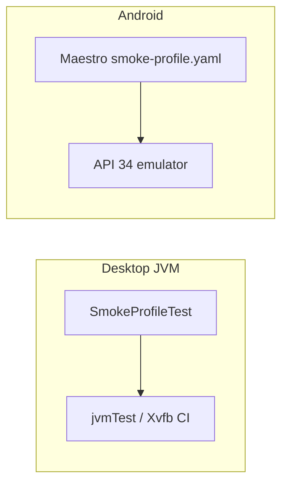

# E2E Testing Handoff

Handoff for Kotlin Multiplatform E2E testing in BTT-Writer (desktop JVM + Android Maestro).

## Goal

Two-layer E2E strategy:

1. **Compose UI tests (JVM/desktop)** — fast, headless smoke test mirroring the Maestro profile flow; runs in `jvmTest` on Windows/Linux/macOS CI.
2. **Maestro (Android)** — black-box smoke test against a real debug APK on an emulator.

Desktop has no Maestro equivalent; the desktop test covers the same user journey via `runComposeUiTest`.

## What Is Implemented

### Gradle & dependencies

- Compose Multiplatform **1.11.1** in `gradle/libs.versions.toml`
- `composeApp/build.gradle.kts`:
  - `jvmTest` — `compose.desktop.currentOs` + `compose.uiTest`
  - Android `packaging.resources.pickFirsts` for duplicate `META-INF/*` in device/test APKs

### Desktop UI tests (`composeApp/src/jvmTest/.../uitest/`)

| File | Purpose |
|------|---------|
| `UiTestHarness.kt` | Koin + `TestDirectoryProvider`, mocked `UpdateApp`, `runComposeUiTest`, starts at `Config.Splash` by default |
| `SmokeFlow.kt` | Shared steps: `completeSmokeLaunch()`, `completeSmokeProfileToSettings()` |
| `SmokeProfileTest.kt` | Single test: cold start → profile → settings |

**Flow covered (matches Maestro `smoke-profile.yaml`):**

1. Splash — dismiss migration (`No`) and hardware warning (`Don't show again` → `Continue`) if shown
2. Wait for profile index (`Create offline Account`)
3. Offline account form → privacy notice → terms (`I Agree`)
4. Home (`Your Translation Projects`) → More Options → Settings → assert `General`

**Notes:**

- Tests are **headless** — no visible window when running `jvmTest` (expected for `runComposeUiTest`).
- `UpdateApp` is **mocked** in the harness so splash completes reliably without network; all other UI interaction is real.
- Default `initialConfiguration` is `Config.Splash` (full user path, not skipped).

### Production code (minimal)

- `DefaultRootComponent`: optional `initialConfiguration` parameter (default `Config.Splash`) for test entry points.

No `UiTestTags`, `testTag` wiring, or separate `uiTest` / `androidDeviceTest` source sets in the repo today.

### Maestro (`.maestro/`)

```
.maestro/
  config.yaml              # appId, android disableAnimations
  flows/
    smoke-launch.yaml      # subflow: cold launch → dismiss dialogs → wait for profile
    smoke-profile.yaml     # full smoke: runFlow smoke-launch + profile → settings
```

`appId`: `org.bibletranslationtools.writer`

**`smoke-launch.yaml`**

- `launchApp` with `clearState: true`
- Hardware warning (`Slow Device`) → `Don't show again` → `Continue` (string is **Don't**, not "Do not") — handled **before** migration (matches app startup order)
- Migration dialog → required `extendedWaitUntil` + `tapOn: "No"` + `assertNotVisible` (always shown after `clearState`; do **not** use `optional: true` or a failed tap hangs on the 300s profile wait)
- Wait up to **60s** for profile title `Please create or login to your account.` (CI debug APK is built with `-PbttE2e=true` to skip the ~158 MB library deploy; local Maestro uses a normal debug build and may need longer)

**`smoke-profile.yaml`**

- `runFlow: smoke-launch.yaml`
- `scrollUntilVisible` for offline card (may be below fold on emulator)
- Full profile → home → settings path
- `waitToSettleTimeoutMs: 500` on taps

Merged former `smoke-offline-profile.yaml` and `smoke-settings.yaml` into `smoke-profile.yaml`.

### CI (`.github/workflows/build.yml`)

**Job order:**

1. **`test-android-e2e`** — Maestro on API 34 emulator (runs first)
2. **`test`** — `jvmTest` with Xvfb (includes desktop smoke test); `needs: test-android-e2e`
3. **Build jobs** — `needs: test`

**E2E job details:**

- Free disk space + enable KVM (Now in Android pattern)
- `android-emulator-runner@v2`: `disk-size: 6000M`, `heap-size: 600M`, `emulator-boot-timeout: 900`, `swiftshader_indirect` GPU
- Assemble debug APK, install Maestro, run **`smoke-profile.yaml` only**
- Use **`"$HOME/.maestro/bin/maestro"`** — `android-emulator-runner` runs each script line in a separate shell, so `export PATH` does not persist

## How to Run

```bash
# Desktop smoke test only (fast, headless)
gradlew :composeApp:jvmTest --tests org.bibletranslationtools.writer.uitest.SmokeProfileTest

# All JVM tests (unit + integration + desktop smoke)
gradlew :composeApp:jvmTest

# Maestro locally (emulator/device + debug APK)
gradlew :androidApp:assembleDebug
adb install -r androidApp/build/outputs/apk/debug/androidApp-debug.apk
maestro test .maestro/flows/smoke-profile.yaml

# Optional: launch subflow only
maestro test .maestro/flows/smoke-launch.yaml
```

On Linux CI desktop tests, the `test` job starts Xvfb automatically. On Windows locally, `jvmTest` runs headless without Xvfb for the smoke test.

## Debugging Lessons

### Desktop (`runComposeUiTest`)

1. **`@OptIn(ExperimentalTestApi::class)`** on harness and tests
2. **`DefaultRootComponent`** created inside `setContent` on the main thread
3. **Essenty `LifecycleRegistry`** + `resume()` for Decompose
4. **`LocalLifecycleOwner`** provided by `runComposeUiTest` (Compose 1.11+)
5. **Mock `UpdateApp` only** — use real `Preference` from Koin; do not skip splash unless testing a narrower path
6. **Two `Continue` buttons** when privacy dialog is open — use `onAllNodesWithText("Continue")[1]` for the dialog button
7. **No visible UI** during `jvmTest` is normal

### Maestro / CI emulator

1. **Emulator boot timeout** — free disk space, KVM, tuned `emulator-options`; avoid heavy `pixel_6` profile on CI
2. **`maestro: not found`** — use full path `$HOME/.maestro/bin/maestro`, not `export PATH` in a prior script line
3. **Hardware dialog** — UI string is `Don't show again`, not `Do not show again`
4. **Splash → profile** can take **several minutes** on CI (bundled `containers.zip` is ~158 MB); `smoke-launch` waits up to 300s for the profile **title**, not the offline card
5. **Profile card off-screen** — `scrollUntilVisible` before tapping `Create offline Account`; `extendedWaitUntil` requires on-screen visibility
6. **Migration dialog** — with `clearState: true` the prompt always appears; use required `extendedWaitUntil` + `tapOn: "No"` (not `optional: true`). A silent optional tap failure leaves the dialog up while Maestro waits minutes for the profile screen.
7. **`when` condition `timeout`** — only supported on newer Maestro; use `extendedWaitUntil` for long waits instead of `timeout` under `runFlow when`.
8. **`qemu-system-x86_64-headless: I/O thread spun`** — benign emulator warning

## Known Issues / Follow-ups

| Issue | Notes |
|-------|--------|
| **Maestro splash on real network** | CI uses `-PbttE2e=true` to skip library deploy; local Maestro on a normal debug APK still runs full `UpdateApp` |
| **Desktop vs Maestro parity** | Desktop mocks `UpdateApp`; Maestro exercises real deploy path |
| **Pre-existing `jvmTest` failures** | Unrelated unit/integration tests may still fail in full `jvmTest` |
| **Android instrumented UI tests** | Not set up; only Maestro for Android E2E today |
| **`runComposeUiTest` v1 deprecation** | Consider migrating to `androidx.compose.ui.test.v2.runComposeUiTest` |

## Architecture



## Files Touched (summary)

- `gradle/libs.versions.toml`
- `composeApp/build.gradle.kts`
- `.github/workflows/build.yml`
- `.maestro/**`
- `composeApp/src/jvmTest/.../uitest/*`
- `composeApp/src/commonMain/.../RootComponent.kt` (`initialConfiguration`)
