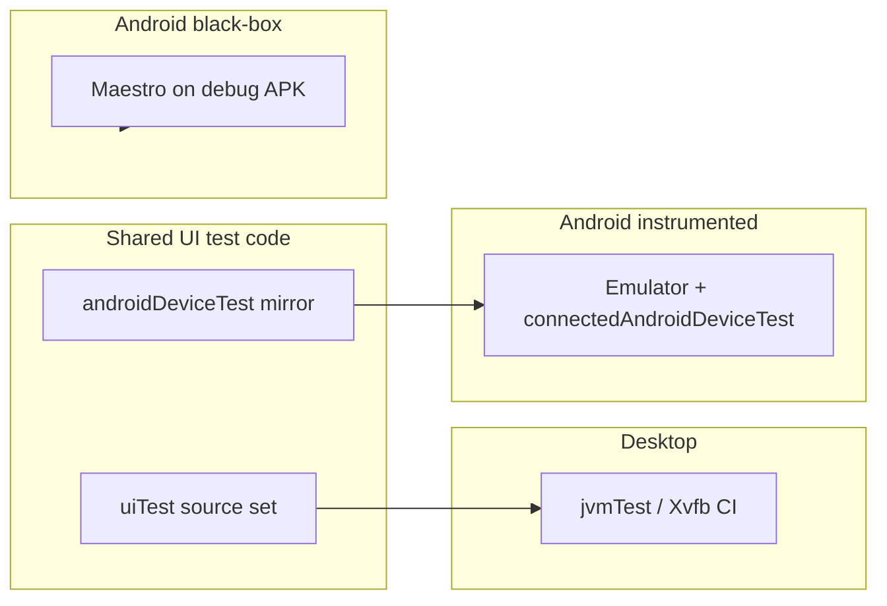

# E2E Testing Handoff

Handoff from chat session (2026-06-24): Kotlin Multiplatform E2E testing for BTT-Writer (desktop + Android).

## Goal

Two-layer E2E strategy:

1. **Compose Multiplatform UI tests** — write once, run on desktop (fast) and Android (instrumented on emulator).
2. **Maestro** — Android black-box smoke tests against a real installed APK.

Desktop has no Maestro equivalent; desktop E2E stays on Compose UI tests.

## What Was Implemented

### Gradle & dependencies

- Compose Multiplatform bumped **1.10.3 → 1.11.1** in `gradle/libs.versions.toml`
- Added `compose-uiTest`, `androidx-ui-test-junit4`, `androidx-ui-test-manifest`
- `composeApp/build.gradle.kts`:
  - `commonTest` — unit/integration tests only (no `compose.uiTest`)
  - `uiTest` source set — shared desktop UI tests (`dependsOn(commonTest)`)
  - `jvmTest` — `dependsOn(uiTest)` + `compose.desktop.currentOs`
  - `androidDeviceTest` — Android-only UI test copies + `compose.uiTest`
  - `androidLibrary { withDeviceTestBuilder { } }` — device tests **do not** share full `commonTest` (avoids DEX errors from JVM unit tests with backtick names containing spaces)
  - Android `packaging.resources.pickFirsts` for `META-INF/DEPENDENCIES`, etc.
- `androidApp/build.gradle.kts`: `testInstrumentationRunner`, `androidTestImplementation` / `debugImplementation` for Compose UI test artifacts

### UI test infrastructure

| File | Purpose |
|------|---------|
| `composeApp/src/uiTest/kotlin/.../uitest/UiTestHarness.kt` | Koin setup, fake `UpdateApp`/`MigrateTranslations`, lifecycle, `launchWriterApp()` |
| `composeApp/src/uiTest/kotlin/.../uitest/NavigationSmokeTest.kt` | Desktop JVM UI smoke tests |
| `composeApp/src/androidDeviceTest/kotlin/.../uitest/` | Mirror of harness + tests for Android instrumented runs |
| `composeApp/src/androidDeviceTest/AndroidManifest.xml` | Minimal manifest for device tests |
| `composeApp/src/commonMain/kotlin/.../ui/UiTestTags.kt` | Stable `testTag` constants |

### Production code changes (for testability)

- **`UiTestTags`** on Splash, Profile offline card, offline form, privacy dialog, terms accept, Home, Settings menu item, Settings screen
- **`DefaultRootComponent`**: optional `initialConfiguration` (default `Config.Splash`); tests start at `Config.Profile(thenLogin = false)` to skip async splash/`UpdateApp`
- **`SidebarAction`**: optional `testTag` (used for `home_settings`)

### Maestro

```
.maestro/
  config.yaml
  flows/
    smoke-launch.yaml          # launch, wait for welcome, dismiss migration
    smoke-offline-profile.yaml # tap offline account, assert name field
```

`appId`: `org.bibletranslationtools.writer`

### CI (`.github/workflows/build.yml`)

- **Existing `test` job** — `Xvfb` + `jvmTest` now includes desktop UI tests automatically
- **New `test-android-e2e` job** — emulator, `assembleDebug`, `connectedAndroidDeviceTest`, Maestro flows (6 GB Gradle heap)

## How to Run

```bash
# Desktop UI tests (fast dev loop)
gradlew :composeApp:jvmTest --tests org.bibletranslationtools.writer.uitest.NavigationSmokeTest

# All JVM tests (includes UI + unit/integration)
gradlew :composeApp:jvmTest

# Android instrumented (emulator/device required)
gradlew :composeApp:connectedAndroidDeviceTest

# Maestro (after debug APK install)
gradlew :androidApp:assembleDebug
adb install -r androidApp/build/outputs/apk/debug/androidApp-debug.apk
maestro test .maestro/flows/
```

## Tests Covered

**`NavigationSmokeTest`**

1. `splash_to_profile_to_home` — profile index → offline account → terms → home
2. `home_to_settings_and_back` — sidebar menu → settings → back to home

Both pass on JVM desktop as of handoff.

## Key Debugging Lessons (from this session)

Initial JVM runs failed for these reasons (all fixed):

1. **`@OptIn(ExperimentalTestApi::class)`** required on harness using `setContent`
2. **`collectAsStateWithLifecycle`** needs `LocalLifecycleOwner` in `setContent` (created inside composition on main thread)
3. **Decompose** `DefaultRootComponent` must be created **inside** `setContent` (main thread), not before
4. **Mocked `Preference`** caused `ClassCastException` when Home read `LAST_TRANSLATION` — use real `Preference` from Koin + pre-set migration/hardware prefs
5. **Splash `UpdateApp` coroutines** don’t advance reliably under test `StandardTestDispatcher` — tests skip splash via `initialConfiguration = Profile`
6. **Android device test DEX** — cannot package all `commonTest` classes (backtick test names with spaces); use separate `androidDeviceTest` sources

## Known Issues / Follow-ups

| Issue | Notes |
|-------|--------|
| **Android device test APK build OOM locally** | `mergeExtDexAndroidDeviceTest` may crash Gradle daemon on low-memory machines; CI uses 6 GB heap |
| **Duplicated UI test code** | `uiTest` (JVM) and `androidDeviceTest` (Android) mirror harness/tests due to KMP source-set tree constraints |
| **Pre-existing `jvmTest` failures** | e.g. `MergeConflictsParseTest`, `UsxBrokenRenderTest`, `ExportProjectsTest` — unrelated to E2E; still fail in full `jvmTest` |
| **Maestro vs real network** | Black-box flows wait up to 120s for splash; no debug flag to skip `UpdateApp` yet |
| **Gradle deprecation warnings** | `androidLibrary { }` block deprecated in favor of `android { }`; `compose.uiTest` catalog entries could be cleaned up |

## Architecture (quick reference)



## Files Touched (summary)

- `gradle/libs.versions.toml`
- `composeApp/build.gradle.kts`
- `androidApp/build.gradle.kts`
- `.github/workflows/build.yml`
- `.maestro/**`
- `composeApp/src/commonMain/.../UiTestTags.kt` + tagged screens (Splash, Profile, Home, Settings, dialogs)
- `composeApp/src/commonMain/.../RootComponent.kt` (`initialConfiguration`)
- `composeApp/src/uiTest/**`
- `composeApp/src/androidDeviceTest/**`
- `composeApp/src/commonMain/.../MenuItems.kt`, `HomeSidebar.kt` (`testTag` on settings)

## Plan Reference

Original plan todos were all marked completed. Plan file was **not** edited per user request (`kmp_e2e_testing_setup_b73f7cc2.plan.md` in Cursor plans).
